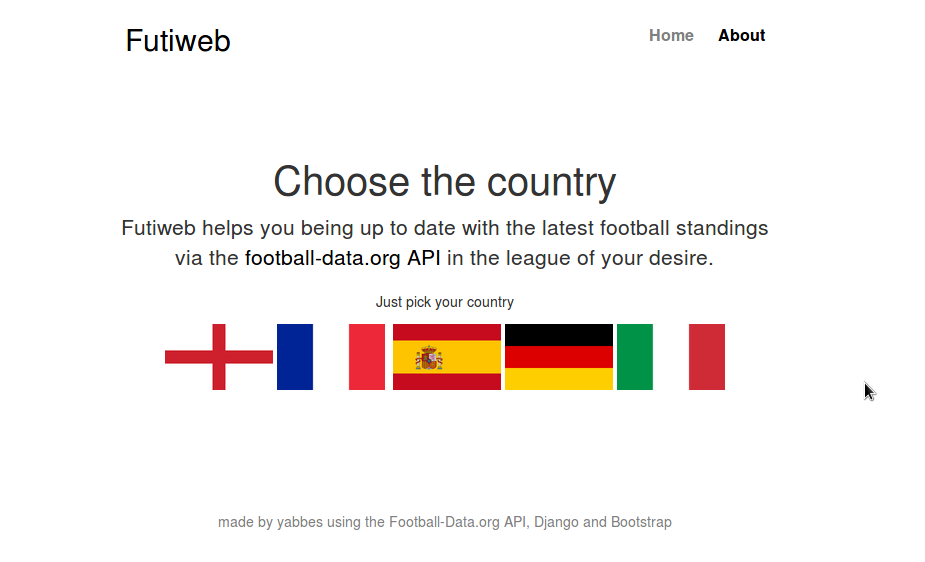
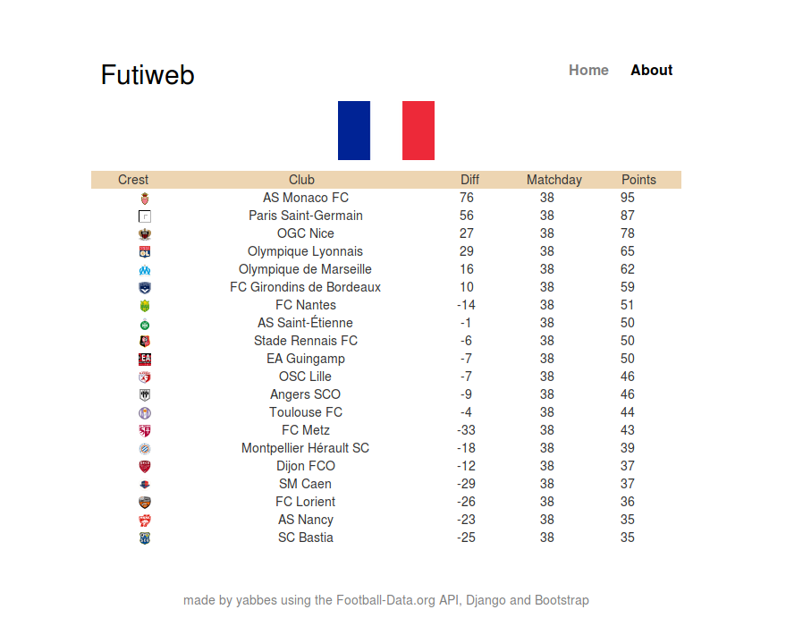

# Futiweb
Django based web app to display European football standings

Standings are retrieved live via an open API of Football-Data.org

Still a work in progress but my first little web app based on the Django framework

Needs to run in a Python3 environment because of urllib.request that is used to retrieve the data.

Of course this project should not be deployed as is, debug mode is turned on etc..

http://yabbes.pythonanywhere.com
